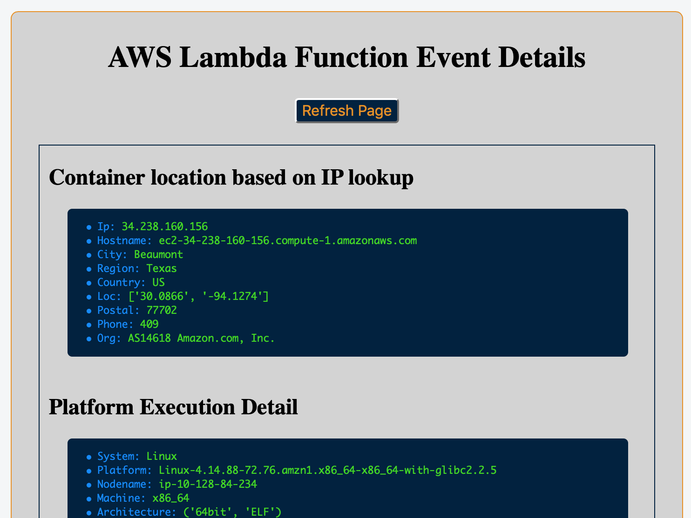

# Display AWS Lambda Details



Lambda event handler written in Python that returns various details about the
function execution environment formatted as HTML DOM for display in a web
browser.

## Function returns the following:
    - Location data based on the IP address of the execution environment
    - Platform Execution information
    - Data passed from the browser client via API Gateway
    - A few attributes of the function execution context

Check it out @: https://api.mikeoc.me/service/beta/showEventDetail?key1=value1&key2=value2&key3=value3

## API Gateway Method Execution

Since program returns CSS/HTML code vs. the typical json, we need to
reconfigure the API Gateway Integration Response associated with the Method Execution. To define a custom response mapping we'll also have to disable Integration Request default Proxy behavior and create a new Request Mapping template. The template controls the structure of the data received by the
event handler so the two are interdependent. Remember to deploy you modified API Gateway following any changes to Method Execution. Here are the relevant console instructions:

### For Integration Request

1. In API Gateway, select the API you specified when creating the lamdba function
2. Select the GET Method for your new lambda function and select Integration Request
3. To add a custom integration template, uncheck the box next to
   Use Lambda Proxy integration and add the new template under Mapping Templates
4. Add Content-Type 'application/json' (don't include quotes)
5. Add mapping template. Here is a sample template that I've found useful:

```
## See http://docs.aws.amazon.com/apigateway/latest/developerguide/api-gateway-mapping-template-reference.html
##  This template will pass through all parameters including path, querystring, header, stage variables, and context through to the integration endpoint via the body/payload

#set($allParams = $input.params()) {
  "body-json" : $input.json('$'),
  "params" : {
      #foreach($type in $allParams.keySet())
      #set($params = $allParams.get($type))
      "$type" : {
        #foreach($paramName in $params.keySet())
        "$paramName" : "$util.escapeJavaScript($params.get($paramName))"
            #if($foreach.hasNext),#end
        #end
      }
      #if($foreach.hasNext),#end
  #end
  },
  "stage-variables" : {
     #foreach($key in $stageVariables.keySet())
     "$key" : "$util.escapeJavaScript($stageVariables.get($key))"
      #if($foreach.hasNext),#end
      #end
      },
  "context" : {
      "account-id" : "$context.identity.accountId",
      "api-id" : "$context.apiId",
      "api-key" : "$context.identity.apiKey",
      "authorizer-principal-id" : "$context.authorizer.principalId",
      "caller" : "$context.identity.caller",
      "cognito-authentication-provider" : "$context.identity.cognitoAuthenticationProvider",
      "cognito-authentication-type" : "$context.identity.cognitoAuthenticationType",
      "cognito-identity-id" : "$context.identity.cognitoIdentityId",
      "cognito-identity-pool-id" : "$context.identity.cognitoIdentityPoolId",
      "http-method" : "$context.httpMethod",
      "stage" : "$context.stage",
      "source-ip" : "$context.identity.sourceIp",
      "user" : "$context.identity.user",
      "user-agent" : "$context.identity.userAgent",
      "user-arn" : "$context.identity.userArn",
      "request-id" : "$context.requestId",
      "resource-id" : "$context.resourceId",
      "resource-path" : "$context.resourcePath"
      }
}
```

### For Integration Response

  1.  In API Gateway, select the API you specified when creating the Lambda function
  2.  Select the GET Method for your new lambda function and select Method Response
  3.  Expand 200 Response and the click on Add Header under Response Headers for 200
  4.  Enter "Content-Type" in the box and click on the check icon to the right
  5.  Select the GET Method again from your lambda function on the left side
  6.  Select Integration Response and expand 200 to add a new mapping to the
      Content-Type Response Header.
  7.  Select the pencil icon to the right and set the Mapping value to:   
      'text/html' (be sure to use single quotes). Save you edit.
  8.  Expand the Mapping Template section and delete the "application/json" content type
  9.  Select "Add mapping template" and enter "text/html" (without quotes).
  10. Select the "text/html" Content Type and set the template value to:

```
  #set($inputRoot = $input.path('$'))
  $inputRoot
```
